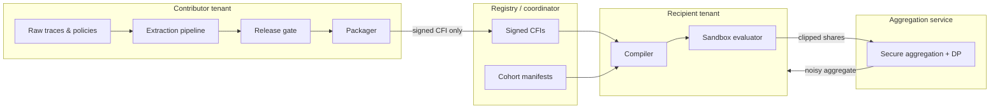

# CFI-Fed Architecture

## Trust zones

## Requirements traceability

| Module | R1–R8 |
|--------|-------|
| `cfi_contributor` | R1, R3 |
| `cfi_core.canonicalize` | R2 (not R3 proof) |
| `cfi_recipient.compiler` | R2, R4, R6 |
| `cfi_recipient.sandbox` | R4, R5 |
| `cfi_federation` | R4, R7 |
| `cfi_governance` | R8 |
| `cfi_registry` | R8 |

## Honesty guardrails

Every API response that includes a rate or privacy metric must include `assumptions`,
`measurement_spec_id`, and `cohort_id` where applicable.
